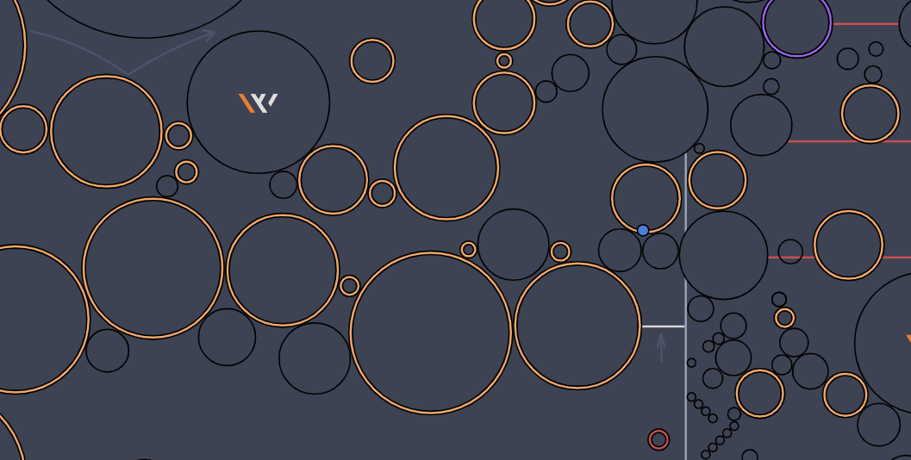

<h1 align="center">⛰️ hax-climb</h1>
<p>
  
  
  
  <a href="https://github.com/jakjus/hax-climb#readme" target="_blank">
    
  </a>
  <a href="https://github.com/jakjus/hax-climb/graphs/commit-activity" target="_blank">
    
  </a>
  <a href="https://github.com/jakjus/hax-climb/blob/master/LICENSE" target="_blank">
    
  </a>
</p>

> Haxball Room Script for Climbing Mod (map and gameplay by Winky)



### 🚀 [Discord](https://discord.gg/dYk5UXs)

## Prerequisites

- npm >=8.6.0
- node >=16.0.0

## Install

```sh
git clone git@github.com:jakjus/hax-climb.git
cd hax-climb/
npm install
```

## Usage

Rename `config.example.ts` with `config.ts`. Insert **token** from https://haxball.com/headlesstoken into `config.ts`.

```ts
// config.ts

export default {
    roomName: `🌕   HaxClimb v1.1 by jakjus`,
    token: `YOUR_TOKEN_HERE`,
}
```

Run Server:
```sh
npm start
```

### Adding maps
To add a new map, follow the format in `src/maps/jakjus-tower.ts`. Then, add appropiate import in `src/maps/maplist.ts`. Map will be changed automatically.

### Settings
Some script settings can be changed in `src/settings.ts`.

### Migration (optional)
*Only if you upgrade from v0.x.x to v1.x.x and some data exists!*

To migrate data (database) from v0.x.x to v1.x.x:
```
npm run migrate
```

## Features
- [x] Winky's Climbing Challenge map
- [x] Checkpoint system
- [x] Timer
- [x] Leaderboards
- [x] SQLite database (persistent stats)
- [x] Multiple maps with separate leaderboards
- [x] Map Voting
- [ ] Multiple databases


## Author

👤 **Jakub Juszko**

* Website: https://jakjus.com
* Github: [@jakjus](https://github.com/jakjus)
* LinkedIn: [@jakubjuszko](https://linkedin.com/in/jakubjuszko)

## 🤝 Contributing

Contributions, issues and feature requests are welcome!<br />Feel free to check [issues page](https://github.com/jakjus/hax-climb/issues). 

## Show your support

Give a ⭐️ if this project helped you!

## 📝 License

Copyright © 2022 [Jakub Juszko](https://github.com/jakjus).<br />
This project is [MIT](https://github.com/jakjus/hax-climb/blob/master/LICENSE) licensed.

***
